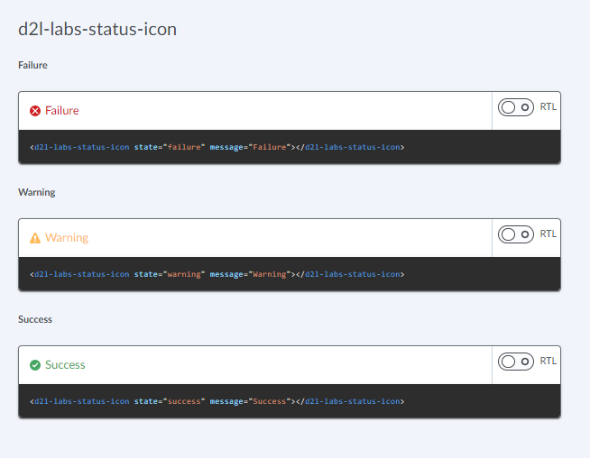

# d2l-labs-status-icon

[](https://www.npmjs.org/package/@brightspace-ui-labs/status-icon)

> Note: this is a ["labs" component](https://github.com/BrightspaceUI/guide/wiki/Component-Tiers). While functional, these tasks are prerequisites to promotion to BrightspaceUI "official" status:
>
> - [ ] [Design organization buy-in](https://github.com/BrightspaceUI/guide/wiki/Before-you-build#working-with-design)
> - [ ] [design.d2l entry](http://design.d2l/)
> - [ ] [Architectural sign-off](https://github.com/BrightspaceUI/guide/wiki/Before-you-build#web-component-architecture)
> - [x] [Continuous integration](https://github.com/BrightspaceUI/guide/wiki/Testing#testing-continuously-with-travis-ci)
> - [x] [Cross-browser testing](https://github.com/BrightspaceUI/guide/wiki/Testing#cross-browser-testing-with-sauce-labs)
> - [x] [Unit tests](https://github.com/BrightspaceUI/guide/wiki/Testing#testing-with-polymer-test) (if applicable)
> - [x] [Accessibility tests](https://github.com/BrightspaceUI/guide/wiki/Testing#automated-accessibility-testing-with-axe)
> - [x] [Visual diff tests](https://github.com/BrightspaceUI/visual-diff)
> - [x] [Localization](https://github.com/BrightspaceUI/guide/wiki/Localization) with Serge (if applicable)
> - [x] Demo page
> - [x] README documentation

Displays an icon as well as optional text to show the state/status of some feature or tool

## Installation

To install from NPM:

```shell
npm install @brightspace-ui-labs/status-icon
```

## Usage

```html
<script type="module">
    import '@brightspace-ui-labs/status-icon/status-icon.js';
</script>
<d2l-labs-status-icon state="failure" message="Failure"></d2l-labs-status-icon>
```



**Properties:**

| Property | Type | Description |
|--|--|--|
| `message` | String | Message to be displayed |
| `state` | String, default: `'failure'` | State of the status. Can be one of  `failure`, `warning`, `success`. |

## Developing and Contributing

After cloning the repo, run `npm install` to install dependencies.

### Testing

To run the full suite of tests:

```shell
npm test
```

Alternatively, tests can be selectively run:

```shell
# eslint
npm run lint:eslint

# stylelint
npm run lint:style

# unit tests
npm run test:unit
```

This repo uses [@brightspace-ui/testing](https://github.com/BrightspaceUI/testing)'s vdiff command to perform visual regression testing:

```shell
# vdiff
npm run test:vdiff

# re-generate goldens
npm run test:vdiff golden
```

### Running the demos

To start a [@web/dev-server](https://modern-web.dev/docs/dev-server/overview/) that hosts the demo page and tests:

```shell
npm start
```

### Versioning and Releasing

This repo is configured to use `semantic-release`. Commits prefixed with `fix:` and `feat:` will trigger patch and minor releases when merged to `main`.

To learn how to create major releases and release from maintenance branches, refer to the [semantic-release GitHub Action](https://github.com/BrightspaceUI/actions/tree/main/semantic-release) documentation.
